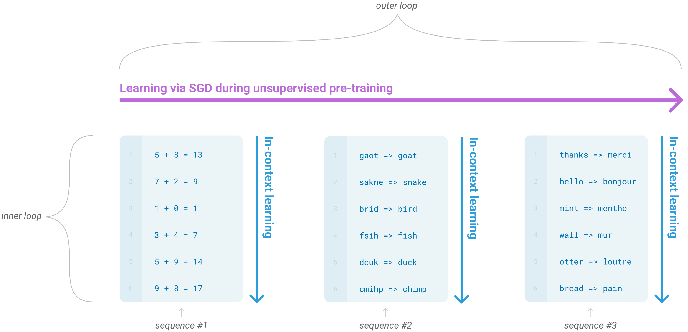

# GPT3

**Language Models are Few-Shot Learners**

- GPT1使用pretrain then supervised fine tuning的方式
- GPT2引入了Prompt，预训练过程仍是传统的语言模型
- GPT2开始不对下游任务finetune，而是在pretrain好之后，做下游任务时加入任务相关描述Prompt，即求 $p(y|x,task)$
- GPT3沿袭了不对下游任务finetune的做法，但是提出可以用少量或者全量数据进行in context-learning，把labeld数据放在提示里，通过上下文提供更多的示例信息

- 在训练过程中，会遇见类似这种表达出任务形式的文本，作者称之为in context-learninig
- 通过这类文本的预训练，能够使模型在推理时能够适应或识别所需/所做的任务



- 模型规模增大，性能增加
- zero-shot和one-shot下，给出prompt效果提升明显
- 有一定数量的sample组成context时，是否给出prompt影响不大


- 模型规模

上下文长度为2048，不足2048的使用特殊标记分隔后拼接到一起


- GPT3训练数据

刻意增大了高质量数据的占比


- **Initial training set filtering** 训练集中，按照13-gram和一些规则，过滤掉了测试集中可能的句子，不过保留了相似的文本。（推翻了我之前关于测试用例出现在训练文本中的猜测，还是得多看原文）

- 计算资源消耗

还真不是一般机构能消耗得起


- 模型结构
    - 沿用GPT2的结构
    - BPE
    - context size=2048
    - token embedding, position embedding
    - Layer normalization was moved to the input of each sub-block, similar to a pre-activation residual network and an additional layer normalization was added after the final self-attention block.
    - always have the feedforward layer four times the size of the bottleneck layer
    - A modified initialization which accounts for the accumulation on the residual path with model depth is used. We scale the weights of residual layers at initial-ization by a factor of 1/√N where N is the number of residual layers:
    
    ```python
    # apply special scaled init to the residual projections, per GPT-2 paper
    # c_proj是self attn和ffn输出的linear层
    for pn, p in self.named_parameters():
        if pn.endswith('c_proj.weight'):
            torch.nn.init.normal_(p, mean=0.0, std=0.02 / math.sqrt(2 * config.n_layer))
    ```
    
    
    
    
    
- 训练细节
    - Adam，β1=0.9，β2=0.95，ε=10e-8
    - gradient norm: 1
    - cosine decay for learning rate down to 10%, over 260 billion tokens
    - increase batch size linearly from a small value (32k tokens) to full value over first 4-12 billion tokens depending on the model size.
    - weight decay: 0.1
    - （个人觉得不太重要，也没法复现，借鉴着用就行）
    
- 效果

**Scaling Laws**. 模型计算量和验证集上交叉熵损失的曲线图。各个规模的模型开始收敛的计算量和验证集上的loss值呈现出power-law relationship。


- 各benchmark实验结果对比详见原文 Section 3
- 运算能力 （有点涌现那味了）


- 随训练过程，train loss和valid loss曲线图

一直没有过拟合


- 限制 （部分）
    - 长文本生成时的重复、前后矛盾
    - 难回答常识问题
    - 可解释性
    - 即使在部分任务上达到了finetune SOTA的性能，在部分任务仍效果很差
    - 结构和算法的限制：使用自回归范式，无法捕获双向信息，可能是导致部分任务效果差的原因
    - 语言模型的通病：每个token的权重相同，但不应如此，需要指导哪些部分更重要
    - 样本效率低：性能接近人类，但是训练数据远远多于人类一生看到的文本。
    - （结合后面工作—加入预训练数据中加入代码后推理能力变强，以及人类真实生活情况，也许在加入世界信息，例如物理规律/现象、化学原理/现象等之后，gpt的能力会更提升一个档次。）
    
- 伦理

目前还太菜，不需要考虑这些问题