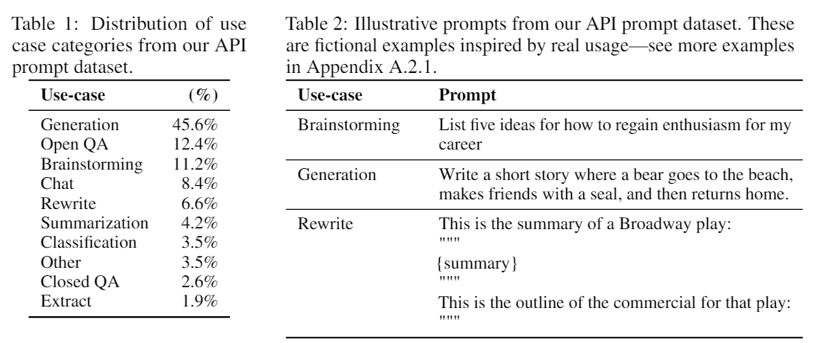

# InstructGPT

**Training language models to follow instructions with human feedback**

- 个人观点（纯感性方面认知）：
    - GPT3已经足够强大，只不过对已学习到的内容的表述上不是人/下游任务所需要的，所以才有了后面火热起来的Prompt Learning。后面所做的连续或者非连续Prompt模板，可能和针对任务的SFT阶段是一个目的。
    - InstructGPT的核心工作在于通过Instruct supervised fine tuning，将模型的表达能力与人的需要对齐。当然之前已经有这类工作了。
    - 这个对齐工作可以成为教GPT如何表达，例如尽可能诚实地表达、尽可能表达有用的内容、尽可能减少有害内容的表达。
    - 该对齐工作也可以视为对下游任务输出形式的一个指导，教会GPT识别任务指令，并通过**一定格式**输出他在预训练过程中学习到的**特定部分**的内容。
    - Instruct supervised finetuning和RLHF，个人觉得可以视为教会GPT输出人所需要的**格式**和**内容。**而回答问题或解决任务所需要的知识，是在预训练阶段获取。
    - 通俗的例子，例如“不利于团结的话不要讲”，GPT通过预训练学习到了一些“不利于团结的”内容，但是通过RLHF，使其尽可能避免输出这部分内容。
    - 类似人类社会道德/三观和表达能力的培养。
    - 后面也许会出现的，各类交叉领域有限数据集tuning出来的LLM，也许只是让GPT对学习到的内容表达更准确一点罢了。当然大规模语料另说。

- 作者的总结：
    - InstructGPT的回复更受标注者的偏好
    - 相比于GPT3，InstructGPT在真实性上有所提升
    - 相比于GPT3，有害性方面改善轻微，偏见问题没有改善
    - 在RLHF期间加入原语言模型损失，能够减少模型在部分NLP任务上性能下降的幅度（貌似SFT也存在这个问题，所以仅对部分任务做finetune会影响模型性能，不过估计也没几个机构有条件全部finetune，而且要finetune的话，还需要大规模的语料用于LLM loss的计算，数据、算力卡死了很多高校和机构）
    - 各种benchmark无法为语言模型提供良好的引导，相比于FLAN和T0两个带Instruction的NLP task datasets finetune出来的模型，标注者更偏好InstructGPT给出的答案。（InstructGPT使用的数据集更好）
    - 模型在RLHF之外的指令上表现出了泛化性，能够理解没见过的指令
    - 仍然会犯简单错误

- Instruction Tuning 指令精调
- 指令构造方式：
1. OpenAI API交互数据
2. 标注人员写的<指令，回答>对
3. 标注人员针对回答，撰写对应的指令
- 语料包含生成、问答、聊天、改写、总结、分类等多种任务，生成类任务占45.6%

- 提示学习、语境学习、指令精调区别：
    - 指令学习：我今天考砸了，我感觉很___
    - 语境学习：天气很好，我感觉很开心。考试考砸了，我感觉很____
    - 指令精调：请给出下列句子表达的情感：我今天考试考砸了。

- 数据集规模（prompt数量）
    - SFT：13k，from API和手写的
    - reward model: 33k，from API和手写的
    - PPO：31k，from API
    
    
    
- 初始模型：Train好的GPT3

- RLHF

框架下分为两个阶段：

1. 奖励模型训练：拟合人类偏好的奖励模型。一个提示、多个回复，组成K个<提示，回复>对，K越大，在新增少量标注时间的代价下，可以多很多标注数据
2. 使用pair-wise ranking loss优化模型：

1. 生成策略优化：RL框架

损失分三个部分：奖励函数的reward，词级别的KL散度，预训练语言模型损失

- 模型公共细节
1. 使用GPT3的结构
2. 使用GPT3的byte pair encodings
3. 上下文长度为2048
4. 限定prompt和response均小于1024
5. Adam, β1=0.9，β2=0.95

- SFT
    - 16 epochs
    - 0.2 residual dropout
    - cosine LR Scheduler down to 10%
    - no warm up
    - For our 1.3B and 6B models,  LR of 9.65e-6, batch size of 32.
    - For 175B,  LR of 5.03e-6, batch size of 8.

- Reward Model
    - 使用6B规模的模型，稳定、降低计算量、表现不错
    - GPT3 ine-tuned on a variety of public NLP dataset
    - 使用GPT3或者SFTGPT3初始化差别不大
    - epoch 1, learning rate 9e-6, cosine LR scheduler, batch size 64
    - 训练对lr和scheduler不敏感，50%以上的不同选择得到了差不多的结果
    - 训练对peoch敏感，epoch变多会过拟合
    - 对每个prompt，选择K个回答，K=4 or K=9，每个batch有64 × C(k, 2)个comparisons
    
- RLHF （RL优化明显复杂一些，这边直接摘录原文Appendix C.3和C.4）
    - Initialize the RLHF models from a pretrained GPT-3 model and apply supervised fine-tuning for 2 epochs on the demonstration dataset.
    - Also mix in 10% pretraining data during fine-tuning, since we find it helpful for PPO training
    - Cosine learning rate schedule is used and the learning rate eventually decays to 10% of the peak learning rate.
    - We use a batch size of 32 for 1.3B and 6B models and 8 for the 175B model.
    - We compare a few different peak learning rates for each model and pick the one with low losses on both the demonstration and the pretraining validation datasets.
    - A log linear sweep of 5 values of the LR’s are compared for 1.3B and 6B models and 3 values are compared for the 175B model.
    - The resultant LR’s for the 1.3B, 6B, and 175B models are 5e-6, 1.04e-5 and 2.45e-6, respectively.
    - KL散度权重β=0.02
    - We train all the RL models for 256k episodes.
    - The batch size for each iteration is 512, with a minibatch size of 64. （这里不是太懂，RL还没怎么看）
    - A constant learning rate is applied with a warmup over the first 10 iterations, starting with one tenth of the peak learning rate.
    - 衰减因子0.992
    - No discount is applied when estimating the generalized advantage
    - The PPO clip ratio is set to 0.2, and the sampling temperature is 1 for rollouts.
    - 奖励函数和值函数均为6B
    - 对于1.3B和6B policy model，value function固定学习率为9e-6
    - 对于175B policy model，value function固定学习率为5e-6
    - use 8 times more pretraining examples than the number of the RL training episodes，以缓解PPO过程中模型退化
    - For each minibatch, we compute the PPO gradients and pretraining gradients in consecutive steps and accumulate them both into the gradient buffers.
    - 预训练损失部分稀疏γ=27.8

- 评估
    - aligned的定义：按照用户的意图回答问题，helpful, honest, and harmless
    - 评估员对结果使用的评价标准
    - 去掉训练集中用过的Instruct

- Baseline
    - SFT InstrcutGPT （使用面向InstructGPT的prompt tuning后的，偏向于人类指令形式）
    - GPT (使用GPT3定制的prompt tuning后的，偏向于language model的形式）
    - GPT
    - PPO（RLHF不带lm损失）
    - PPO-ptx（RLHF带lm损失）

- 实验结果

- 讨论
1. 对齐了什么？主要是有偏的讨论
    1. 标注人员的一致性73%
    2. 标注人员、标注界面带来的bias
    3. 从api收集的prompt，带来的用户的bias；缺乏上下文，标注员的bias
2. As discussed in detail in Gabriel (2020), there are subtle differences between aligning to instructions, intentions, revealed preferences, ideal preferences, interests, and values.