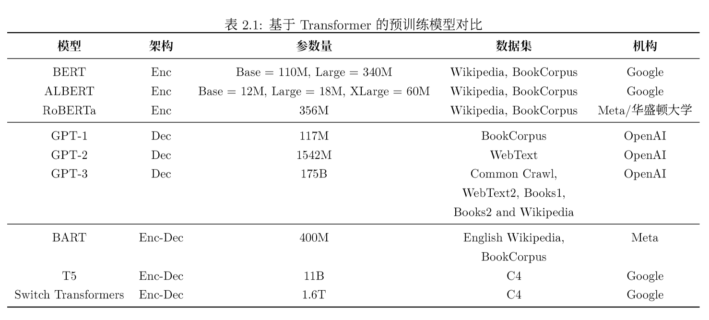

# 哈工大《ChatGPT调研报告》笔记

- 规模

GPT1：1.2亿

GPT2：15亿

GPT3：1750亿

- 发展路径

GPT3之后，分为Codex为代表的代码预训练，以及InstructGPT为代表的文本指令预训练技术。

指令学习（Instruction Learning）→ 有监督精调（Supervised Fine-tuning）→  RLHF

- 模型规模

- Instruction Tuning 指令精调

通过构造指令，学习人类交互模式的分布，使模型与人类行为对齐。

指令构造方式：

1. OpenAI API交互数据
2. 标注人员标注的<指令，回答>对
3. 标注人员针对回答，撰写对应的指令

语料包含生成、问答、聊天、改写、总结、分类等多种任务，生成类任务占45.6%

- 提示学习、语境学习、指令精调
    - 指令学习：我今天考砸了，我感觉很___
    - 语境学习：天气很好，我感觉很开心。考试考砸了，我感觉很____
    - 指令精调：请给出下列句子表达的情感：我今天考试考砸了。

- RLHF

框架下分为两个阶段：

1. 奖励模型训练：拟合人类偏好的奖励模型。一个提示、多个回复，组成多个<提示，回复>对，倾向性标签预测。
2. 生成策略优化：RL框架；损失函数引入了词级别的KL惩罚项；兼顾预训练损失。

- 硬件消耗
    
    Nvidia自己训练的GPT使用了3072张80G A100，最大规模达到1T
    
- 并行计算
    - 模型并行：网络结构，模块的拆分
    - 数据并行：数据上的拆分。
        - Data Parallel
        - Distributed Data Parallel
        - Fully Sharded Data Parallel 《Fully Sharded Data Parallel: faster AI training with fewer GPUs》
    - 并行框架
    
    
    

- 部署框架：
    - **TensorRT：**NVIDIA公司针对自家GPU开发的部署工具
    - **ONNX Runtime：**由微软、亚马逊 、Facebook 和 IBM 等公司共同开发的开放神经网络交换格式
    - **NCNN：**腾讯公司开发的移动端平台部署工具
    - **OpenVino：**Intel公司针对自家设备开开发的部署工具
    - **MediaPipe：**Google针对自家硬件设备和深度学习框架开发的部署工具
    
- 数据集
    
    在对大模型做大规模评价之后，[57]发现训练数据中含有代码的模型具有很强的语言推理能力。在对 OpenAI 的各个模型测试中，也发现代码预训练与 COT 表现息息相关。
    
    因此，在预训练时使用代码数据成为越来越多研究者的共识。
    

- InstructGPT数据集
    - 轻规模，重指令质量。
    - 任务数量也很重要，但是当任务数量超过一定规模后提升并不明显。

